# NerdQAxe++ Big-Screen fork

This is a fork of
[`XTVDDICT/NerdQaxePlus-Rev6.1-BigScreen`](https://github.com/XTVDDICT/NerdQaxePlus-Rev6.1-BigScreen),
which is itself a fork of
[`shufps/ESP-Miner-NerdQAxePlus`](https://github.com/shufps/ESP-Miner-NerdQAxePlus)
("NerdQAxe++") with a native 480x320 display profile added. This fork adds a
thermal/electrical governor and 15 new rotating display screens on top of
that base. It targets the NerdQAxe++ Rev 6.1 board with the YYSLUPING
480x320 display (build profile `BOARD=NERDQAXEPLUS2`,
`DISPLAY_PROFILE=YYSLUPING_480X320`, see `main/CMakeLists.txt`).

All credit for the base miner, AxeOS, and the 480x320 display port goes to
the upstream projects and their maintainers; see the preserved upstream
README below for their own history and instructions.

## What's new

- A pure control-law thermal/electrical governor that dynamically adjusts
  ASIC frequency and core voltage to hold the voltage regulator's
  temperature under control, instead of a fixed frequency/voltage pair.
- 15 new full-screen 480x320 LVGL screens (dashboard, energy flow, per-chip
  view, efficiency, luck, halving, shares, block-reward poster, 24h ring,
  hashrate chart, power bill receipt, room-thermometer estimate, governor
  logbook, a minimal "zen" screen, and an analog clock), cycled by the
  existing screen rotation.
- A data layer (`main/ui_data.*`) that derives history, energy/cost
  tracking, an estimated room temperature, and a governor action diary for
  the screens above.
- A `GET`/`PATCH /api/system/screens` API and a "Screens" page in AxeOS to
  configure the rotation, per-screen duration, and power-bill
  currency/price live, without rebuilding firmware.
- `CONFIG_LV_USE_FONT_COMPRESSED=y`, required for the new screens' RLE-
  compressed bitmap fonts to render at all.

See [`BIGSCREEN-MODS.md`](BIGSCREEN-MODS.md) for the full technical
breakdown.

## Screens

The images below are 480x320 renders produced by the PC screen simulator
(`tools/sim/`) using example/simulated data, not photos of a physical
display.

<table>
<tr>
<td align="center">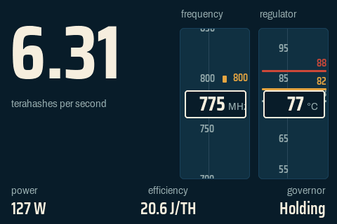<br>Dashboard - hashrate hero with scrolling frequency and regulator-temperature tapes.</td>
<td align="center">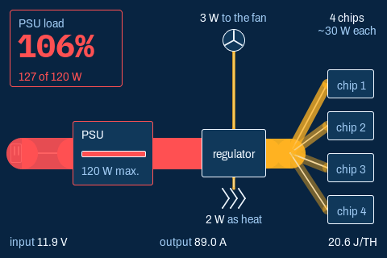<br>Energy flow - wiring diagram of the power path, line thickness proportional to watts.</td>
<td align="center">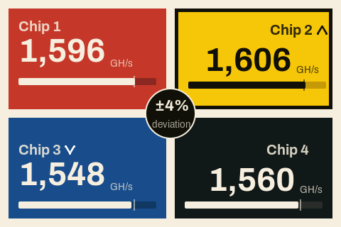<br>Quartet - the 4 ASIC chips as 4 color-coded quadrants with a share-accepted flash.</td>
</tr>
<tr>
<td align="center">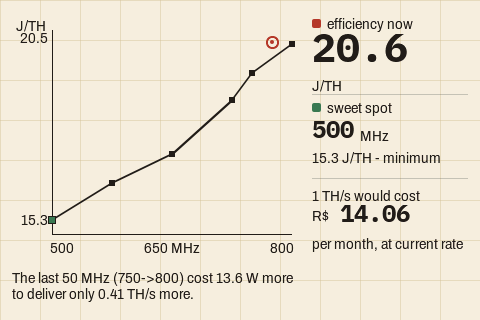<br>Efficiency - J/TH-by-frequency chart from this unit's own measured frequency sweep.</td>
<td align="center">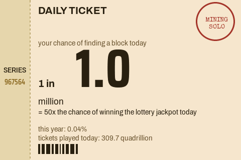<br>Luck - raffle-ticket-styled view of solo-mining odds and hashes played since midnight.</td>
<td align="center">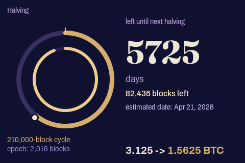<br>Halving - the block-reward halving cycle and difficulty epoch as two concentric rings.</td>
</tr>
<tr>
<td align="center">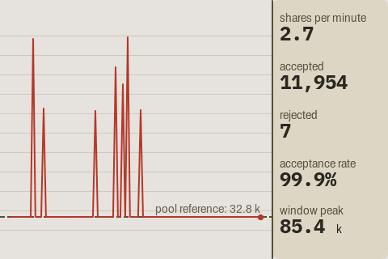<br>Shares - strip-chart of accepted share difficulty against the pool's difficulty, with a stale-share warning.</td>
<td align="center">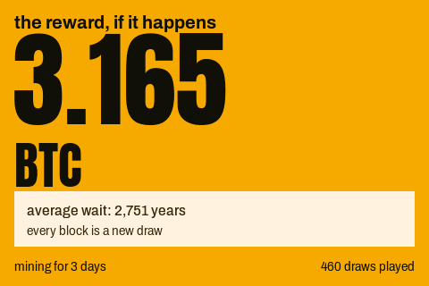<br>If we hit a block - poster-style screen showing the block reward and the honest odds.</td>
<td align="center">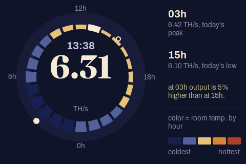<br>Last 24 hours - a 24-slice ring of the day's hashrate and estimated room temperature.</td>
</tr>
<tr>
<td align="center">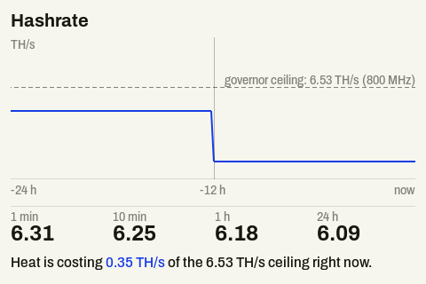<br>Hashrate - hashrate over time with rolling averages and a frequency-ceiling reference line.</td>
<td align="center">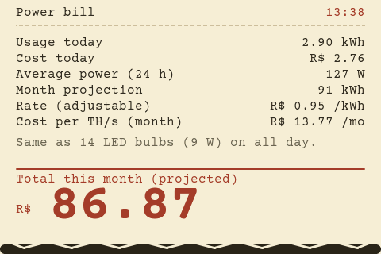<br>Power bill - a receipt-styled breakdown of running cost, in the configured currency and price per kWh.</td>
<td align="center">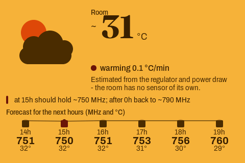<br>Room - the miner used as a room thermometer: estimated ambient temperature, trend, and a forecast strip.</td>
</tr>
<tr>
<td align="center">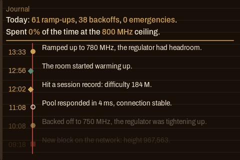<br>Journal - a logbook of governor actions and time spent at the frequency ceiling.</td>
<td align="center">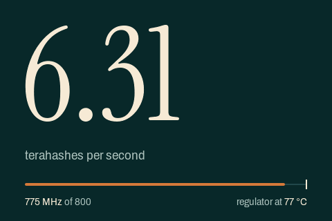<br>Zen - just the hashrate, large, plus a thermal-headroom bar.</td>
<td align="center">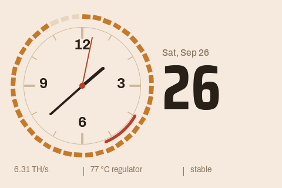<br>Clock - an analog clock whose bezel doubles as a frequency-ceiling gauge and whose dial arc shows thermal headroom.</td>
</tr>
<tr>
<td align="center">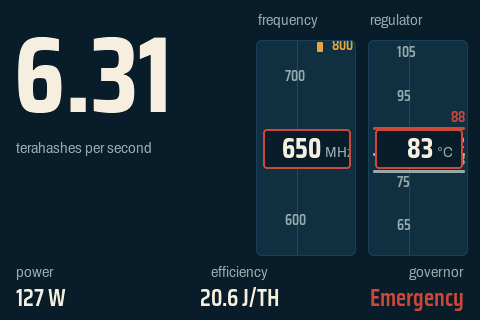<br>Dashboard during a thermal emergency - the same screen with the governor in its EMERGENCY state.</td>
<td></td>
<td></td>
</tr>
</table>

## Thermal governor

The governor (`main/thermal_governor.h/.cpp`) is a pure control law (no
I2C/FreeRTOS/allocation in the core logic) that samples voltage-regulator
temperature and electrical readings every ~2 s, evaluates emergencies on
every sample, and makes regular up/down frequency decisions every ~10 s. It
targets a regulator temperature (`vrTemp`) of 78 degC with a hard ceiling
of 82 degC, and a second internal regulator sensor (`vrTempInt`) at 90 degC
with a hard ceiling of 94 degC; input current, output current, input
voltage, and input power limits can each be enabled independently (a limit
of 0 disables that constraint). It includes plausibility gating, median
filtering, EMA smoothing, rate-limited frequency ramps, and a
crash-loop guard (`main/main.cpp`): if the device reboots from a crash
twice in a row, the governor is forced off for that boot session only (RAM
flag, not written to NVS).

Modes (`PowerManagementTask::m_govMode`, `main/tasks/power_management_task.h`):

| Mode | Meaning |
|---|---|
| `0` | Off - the governor never touches frequency/voltage. |
| `1` | Active - the governor's decision is applied to the ASICs. |
| `2` | Shadow - the governor computes decisions from live telemetry but the base frequency is read from the miner, and nothing is applied. Useful to observe what it *would* do before trusting it. |

### How to use it

The governor is configured entirely through the existing `PATCH
/api/system` endpoint, under a `"governor"` object. There is no governor
page in the AxeOS web UI yet. If OTP is enabled on the device
(`GET /api/system/info` -> `"otp"`), this PATCH requires either a valid
`X-TOTP` header or a previously-established `X-OTP-Session` header
(`validateOTP()` / `main/http_server/http_utils.cpp`) - without OTP enabled,
no extra header is needed.

Turn it on in shadow mode first, to see what it would decide without it
touching the hardware:

```bash
curl -X PATCH http://<miner-ip>/api/system \
  -H 'Content-Type: application/json' \
  -H 'X-TOTP: 123456' \
  -d '{"governor":{"enable":2}}'
```

Watch `GET /api/system/info`'s `governor` object for a while, then switch
it to active:

```bash
curl -X PATCH http://<miner-ip>/api/system \
  -H 'Content-Type: application/json' \
  -H 'X-TOTP: 123456' \
  -d '{"governor":{"enable":1,"vrTarget":75,"ioutMax":85}}'
```

Only integers are accepted for every numeric governor field below (a value
like `78.0` is silently ignored, not rounded - `main/http_server/handler_system.cpp`).
Fields accepted by the `"governor"` object
(`main/http_server/handler_system.cpp` PATCH handler, defaults and units
from `main/nvs_config.h`):

| Field | Meaning | Default | Unit |
|---|---|---|---|
| `enable` | Governor mode: 0 off / 1 active / 2 shadow | `0` | mode id |
| `vrTarget` | Regulator temperature target | `78` | degC |
| `vriTarget` | Internal regulator temperature target | `90` | degC |
| `ioutMax` | Output current limit (0 disables) | `92` | A |
| `vinMin` | Input voltage floor (0 disables) | `11500` | mV |
| `pinMax` | Input power limit (0 disables) | `0` (disabled) | W |
| `iinMax` | Input current limit (0 disables) | `0` (disabled) | 0.1 A steps |
| `fmin` | Minimum frequency the governor will use | `500` | MHz |
| `vmin` | Minimum core voltage | `1100` | mV |
| `vsagMv` | Voltage-sag emergency threshold | `50` | mV |
| `hrMin` | Minimum acceptable hashrate ratio before backing off | `88` | % |
| `curve` | Frequency:voltage curve, e.g. `"500:1100,725:1210,800:1250"` | see left | `"MHz:mV,..."` |

The frequency/voltage ceiling itself is not a governor field: it is the
existing saved `frequency`/`coreVoltage` pair (same `PATCH /api/system`
body, top level), which the governor treats as its own cap and never
writes back to.

Read the live state from `GET /api/system/info`'s `"governor"` object,
filled by `ThermalGovernor::fillJson()`:

- `mode`, `forcedOff`, `state`, `limiter`, `freq`, `voltage`, `freqCap`,
  `voltageCap`, `blockedFreq`, `vTrim`, `lastAction`, `lastReason`,
  `lastActionAgeS`, `margin`
- `filtered`: `vrTemp`, `vrTempInt`, `pin`, `iin`, `vin`, `iout`, `slope`,
  `predVr`, `predVrInt`, `hrRatio`
- `margins`: `vr_temp`, `vr_temp_int`, `pin`, `iin`, `iout`, `vin`
- `counters`: `ups`, `downs`, `emergencies`
- `cfg`: `vrTarget`, `vrHard`, `vriTarget`, `vriHard`, `ioutMax`, `vinMin`,
  `pinMax`, `iinMax`, `fmin`, `vmin`, `vsagMv`, `hrMin`, `curve`

## Display rotation & Screens page

AxeOS has a "Screens" page (`main/http_server/axe-os/src/app/pages/screens/`)
to turn individual screens on/off, set seconds-per-screen per screen and a
default duration for all of them, and set the currency and price per kWh
used by the "Power bill" screen. Saving goes through the same OTP flow as
other settings changes.

The same settings are available directly through
`GET`/`PATCH /api/system/screens`:

```bash
curl -X PATCH http://<miner-ip>/api/system/screens \
  -H 'Content-Type: application/json' \
  -H 'X-TOTP: 123456' \
  -d '{
    "screens": [{"id": 1, "enabled": true, "secs": 12}],
    "defaultSecs": 10,
    "powerBill": {"currency": "R$", "pricePerKwh": 0.75}
  }'
```

Real limits, enforced server-side before anything is written
(`main/ui_data.h`, `main/http_server/handler_system.cpp`):

- `secs` / `defaultSecs`: 3-600 seconds.
- `pricePerKwh`: 0-10.
- `currency`: 1-4 bytes.
- At least one screen must stay enabled; an unknown screen id or an
  out-of-range value fails the whole request with nothing applied.

## Building & flashing

Firmware (Docker, ESP-IDF 5.3.3), from the repository root:

```bash
docker run --rm -v "$PWD":/project -w /project \
  -e BOARD=NERDQAXEPLUS2 -e DISPLAY_PROFILE=YYSLUPING_480X320 \
  -e IDF_GIT_SAFE_DIR=/project \
  espressif/idf:v5.3.3 \
  idf.py -B build-16mb -DSDKCONFIG=build-16mb/sdkconfig \
    -DSDKCONFIG_DEFAULTS=sdkconfig.defaults -DBUILD_WEB=OFF app
```

This builds with `-DBUILD_WEB=OFF`, i.e. it uses whatever is already in
`main/http_server/axe-os/dist/axe-os` instead of rebuilding the web UI. To
regenerate that web UI, run the Angular project's own `npm` scripts from
`main/http_server/axe-os/` (see its `package.json`):

```bash
cd main/http_server/axe-os
npm install
npm run build
```

`npm run build` runs `ng build --configuration=production`, gzips the
output, and leaves it in `dist/axe-os`. When `BUILD_WEB` is left on (the
default), `main/CMakeLists.txt` packages that directory into the `www`
SPIFFS partition at build time (`spiffs_create_partition_image(www ...)`).

Updating a running device:

- Through the AxeOS web UI's Settings page ("Update" section), for both a
  one-click GitHub release install and a manual `.bin` upload.
- Directly over the API: `POST /api/system/OTA` with the firmware binary
  as the raw request body updates the application, and
  `POST /api/system/OTAWWW` with the web `dist/axe-os` binary image
  updates the `www` partition (`main/http_server/handler_ota.cpp`). Both
  require OTP the same way as other write endpoints, except when the
  device is in its own recovery mode.

The PC screen simulator (renders every screen to PNG without hardware) and
the host unit tests (thermal governor control law, display data layer
math) do not need the ASIC/board headers and build much faster - see
`tools/sim/README.md`, `test/host_governor/test_governor.cpp`, and
`test/host_ui_data/test_ui_data.cpp`.

## Safety / disclaimer

This fork changes frequency/voltage control and adds an autonomous
governor that actively drives the ASICs' operating point. Overclocking and
automated voltage/frequency control carry a real risk of instability,
overheating, or hardware damage. Test with the governor in shadow mode
first, keep an eye on regulator and chip temperatures, and use this at
your own risk.

See [`BIGSCREEN-MODS.md`](BIGSCREEN-MODS.md) for the full technical
breakdown of every change in this fork.

---

# Upstream README

Everything below this line is the upstream project's own README
(`XTVDDICT/NerdQaxePlus-Rev6.1-BigScreen`, `main` branch), preserved as-is.

# NerdQaxe++ Rev 6.1 Big-Screen Firmware

This community fork adds a native 480 x 320 interface and 32 MB BOYA flash
support for the YYSLUPING NerdQaxe++ Rev 6.1 big-screen model. It keeps the
upstream miner, AxeOS, pool, and tuning behavior while making the built-in
display readable and fully usable at its actual resolution.


## Release

The hardware-tested release is
[`v1.0.37.2-bigscreen.1`](https://github.com/XTVDDICT/NerdQaxePlus-Rev6.1-BigScreen/releases/tag/v1.0.37.2-bigscreen.1).

- Firmware: `nerdqaxepp-rev61-bigscreen-v1.0.37.2-bigscreen.1.bin`
- SHA-256: `1D94AC66E3EA142F4912EF7FA77B6B1792F4D3B81408CE51D157A33D2AD3537A`
- Image size: 2,995,216 bytes
- Base firmware: upstream `v1.0.37.2-LTS`

### Compatibility

Use this build only with the YYSLUPING NerdQaxe++ Rev 6.1 big-screen unit that
reports board version `501`, has a 480 x 320 ST7789-compatible display, a BOYA
BY25Q256FS 32 MB flash chip (JEDEC `0x684019`), and 8 MB PSRAM. It is not a
generic NerdQaxe++ display update.

The release binary is an application/OTA image, not a full-flash image. Back up
your original firmware first, then install it through the normal AxeOS firmware
update page. Do not write it at flash offset `0x0`, and do not erase the device.
Existing NVS configuration is preserved by a normal OTA update, but keeping a
backup is still strongly recommended.

This release was built with ESP-IDF 5.3.3 and tested on one physical Rev 6.1
unit under mining load. The display, web UI, both fans, all ASICs, temperature,
power, hashrate, and whole-watt power formatting were exercised successfully.
Faint remnants of the stock graphics on some panels are LCD image retention,
not content drawn by this firmware.

## Big-Screen Build

Start from a clean build directory and explicitly select both the NerdQaxe++
board and YYSLUPING display profile:

```powershell
$env:BOARD = 'NERDQAXEPLUS2'
$env:DISPLAY_PROFILE = 'YYSLUPING_480X320'
idf.py -B build-yysluping `
  "-DSDKCONFIG=$PWD\build-yysluping\sdkconfig" `
  "-DSDKCONFIG_DEFAULTS=$PWD\sdkconfig.defaults;$PWD\sdkconfig.yysluping.defaults" `
  set-target esp32s3
idf.py -B build-yysluping `
  "-DSDKCONFIG=$PWD\build-yysluping\sdkconfig" `
  "-DSDKCONFIG_DEFAULTS=$PWD\sdkconfig.defaults;$PWD\sdkconfig.yysluping.defaults" `
  build
```

Leaving `DISPLAY_PROFILE` unset preserves the upstream 320 x 170 display path.
The profile is rejected at configure time for boards other than
`NERDQAXEPLUS2`.

## Changes In This Fork

- Adds an opt-in `YYSLUPING_480X320` display profile.
- Rebuilds the mining, settings, market, network, setup, splash, QR, error, and
  shutdown screens for 480 x 320.
- Adds exact-ID support for the BOYA BY25Q256FS 32 MB SPI flash.
- Matches the unit's stock 32 MB partition layout and 5 MB OTA slots.
- Displays power as whole watts on the big-screen layout so the value remains
  legible.
- Leaves upstream behavior unchanged when the big-screen profile is not chosen.

## Upstream And License

This project is based on
[`shufps/ESP-Miner-NerdQAxePlus`](https://github.com/shufps/ESP-Miner-NerdQAxePlus).
Thanks to its maintainers and the Bitaxe, NerdAxe, and NerdQaxe contributors.
The source remains licensed under GPL-3.0; see [LICENSE](LICENSE).

---

[](https://discord.gg/3E8ca2dkcC)

# ESP-Miner-Nerdaxe version

| Supported Targets | ESP32-S3              |
| ----------------- | --------------------- |
| Required Platform | >= ESP-IDF v5.3.X       |
| ----------------- | --------------------- |

This is a forked version from the NerdAxe miner that was modified for using on the [NerdQAxe+](https://github.com/shufps/qaxe).

Credits to the devs:
- BitAxe devs on OSMU: @skot/ESP-Miner, @ben and @jhonny
- NerdAxe dev @BitMaker


## How to flash/update firmware

The newest releases are always here:

https://github.com/shufps/ESP-Miner-NerdQAxePlus/releases

### Recommended Method: The Webflasher

The [Webflasher](https://shufps.github.io/nerdqaxe-web-flasher/) (modified fork of the great [Bitaxe Webflasher](https://github.com/bitaxeorg/bitaxe-web-flasher) by [Wantclue](https://github.com/WantClue)) is the easiest method of updating all Nerd*axe variants.

[](https://shufps.github.io/nerdqaxe-web-flasher/)

It uses the official releases published on this repository and is always up-to-date.

### Other Methods

#### Clone repository and prepare config

First you need to clone the repository and create a local copy of the config file:

```bash
# clone repository
git clone https://github.com/shufps/ESP-Miner-NerdQAxePlus

# change into the cloned repository
cd ESP-Miner-NerdQAxePlus

# copy the example config
cp config.cvs.example config.cvs
```

Then you can edit the fields like `stratumurl` and so on.

#### Bitaxetool

After the changes on the `config.cvs` files are done, you use the `bitaxetool` to flash factory binary and the config onto the device.

To switch it into bootload mode, reset the device with presset `boot` button.

```
bitaxetool --config ./config.cvs --firmware esp-miner-factory-NERDQAXEPLUS-v1.0.10.bin

```


## How to build firmware

### Using Docker

Docker containers allow to use the toolchain without installing `esp-idf` or `Node 20.x` on the system.

#### 0. TL;DR - `esp-miner.bin`, `www.bin`
```bash

# only once
cd docker
./build_docker.sh
cd ..

export BOARD="NERDQAXEPLUS2"
./docker/idf.sh set-target esp32-s3

# after each change on the source code
./docker/idf.sh build
```

Afterwards you will have a `esp-miner.bin` and `www.bin` in your `build` directory.


#### 1. First build the docker container

```bash
cd docker
./build_docker.sh
```

#### 2. How to use it

There are several scripts in the `docker` directory but what is most flexible is to just start the container as bash via

```bash
./docker/idf-shell.sh
```

You will get a new terminal that provides tools like:
- `idf.py`
- `bitaxetool`
- `esptool.py`
- `nvs_partition_gen.py`

The current repository will be mounted to `/home/builder/project`.

The default `builder` user has `uid:gid = 1000:1000` (like the main user on *buntu/Mint)

#### 3. Compiling & Flashing using the shell

#### 3.1. Just flashing with dockered `bitaxetool` with factory binary

(no `idf-shell.sh` version)

```bash
./docker/bitaxetool.sh --config config.cvs --firmware esp-miner-factory-NERDQAXEPLUS-v1.0.10.bin -p /dev/ttyACM0
```

##### 3.2. Compiling & Flashing using BitAxe tool

(inside of `idf-shell.sh`)

```bash
# start idf-shell
./docker/idf-shell.sh

# set board
export BOARD="NERDQAXEPLUS2"

# set target and build the binaries
idf.py set-target esp32s3
idf.py build

# merge all partitions including config into a single binary
./merge_bin.sh nerdqaxe+.bin

bitaxetool --config config.cvs --firmware esp-miner-factory-nerdqaxe+.bin  -p /dev/ttyACM0
```

#### 3.3. All manual steps for building and flashing

(inside of `idf-shell.sh`)

```bash
# start idf-shell
./docker/idf-shell.sh

# set board
export BOARD="NERDQAXEPLUS2"

# set target and build the binaries
idf.py set-target esp32s3

# optional if you want to change the sdkconfig
idf.py menuconfig

# build the binaries
idf.py build

# creat config.bin nvm partition from config.cvs
nvs_partition_gen.py generate config.cvs config.bin 12288

# merge all partitions including config into a single binary
./merge_bin_with_config.sh nerdqaxe+.bin

# flash using esptool
esptool.py --chip esp32s3 -p /dev/ttyACM0 -b 460800 \
  --before=default_reset --after=hard_reset write_flash \
  --flash_mode dio --flash_freq 80m --flash_size 16MB 0x0 nerdqaxe+.bin
```


When done just `exit` the shell.


### Without Docker

Install bitaxetool from pip. pip is included with Python 3.4 but if you need to install it check <https://pip.pypa.io/en/stable/installation/>

```
pip install --upgrade bitaxetool
```

## Grafana Monitoring


The NerdQaxe+ firmware supports Influx and the repository provides an installation with Grafana dashboard that can be started with a few bash commands: https://github.com/shufps/ESP-Miner-NerdQAxePlus/tree/master/monitoring
